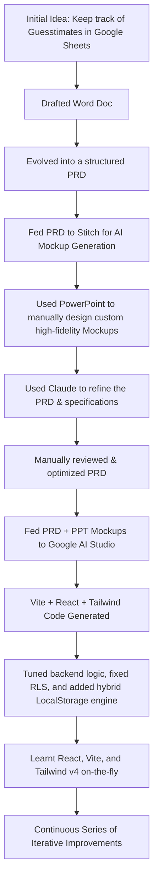

# 🧮 Guesstimate Tracker

[](https://vitejs.dev/)
[](https://react.dev/)
[](https://tailwindcss.com/)
[](https://supabase.com/)
[](https://ai.google.dev/)

Guesstimate Tracker is an elegant, premium, and highly responsive web application designed for framing, solving, and cataloging **Guesstimation problems**, market-sizing challenges, and back-of-the-envelope calculations. Inspired by classic physics logic, commercial case studies, and engineering estimations, it serves as my personal tracker for the same.

👉 **Live Sandbox:** [PLAY.SIDELOWER.IN](https://play.sidelower.in)

---

## 🛠️ The Vibe Coding & AI Workflow Story

This application is a personal project built by me using an intentional, modern (ahem) **AI-Assisted "Vibe Coding" Workflow**. It represents a journey of learning, faltering, and iteratively improving high-fidelity full-stack prototypes.

Here is how Guesstimate Tracker was conceived and built:



### Key Milestones:
1. **The Spark:** It started as a simple need to document and track personal guesstimate mock-interview questions inside a spreadsheet, but quickly grew into an ambition to build a beautiful tool.
2. **The Document:** A casual scratchpad slowly evolved into a rigorous Product Requirements Document (PRD).
3. **The Design Iterations:**
   * Fed the initial PRD into **Stitch** to brainstorm user-interface mockups.
   * Unfamiliar with Figma, Soham leveraged the surprising flexibility of **Microsoft PowerPoint** to craft high-fidelity mockups.
4. **AI-Driven Refinement:** Used **Claude** to challenge and optimize the PRD, catching edge cases and outlining the schema.
5. **The Generation Engine:** Handed the complete PRD and PowerPoint mockups over to **Google AI Studio** to generate the core Vite, React, and Tailwind v4 codebase.
6. **Backend Engineering:** Took the generated frontend and spent hours refactoring code, designing a unified dual-engine database layer, hooking up Supabase, managing authentication routes, and optimizing performance.
7. **Educational Gains:** Learnt the details of React 19, TypeScript, Tailwind CSS v4, and Vite configuration from scratch in a loop of "falter, debug, learn again."

---

## ✨ Features

### 👤 User Workspace
* **Notes Space:** An interactive scratchpad overlay (`WorkspaceModal`) to frame estimations, detail numerical assumptions, note sources, and save records.
* **Smart Filter & Search:** Easily parse guesstimates by keyword, custom categories (e.g., *Market Sizing, Scientific, Fermi Estimate, Population*), difficulty levels (*Easy, Medium, Hard*), and completion states.
* **Hybrid Progress Tracking:** Mark items as **Solved** or flag them for **Retry** with dynamic status visualizers.
* **Community Reactions:** Express feedback with native upvoting and downvoting on guesstimate questions.
* **Personal Analytics Dashboard:** Review your aggregate statistics, completion ratios by difficulty, and total solved counts.

### 🔑 Administrator Dashboard
* **Dynamic Content Studio:** Add, modify, or deprecate guesstimate challenges through a graphical editor.
* **Bulk Upload Engine:** Batch-import questions instantly using **Excel (XLSX)**, **CSV**, or structured **JSON** files.
* **User Management:** *Local Only!* Provision new administrative accounts, register new practitioners, and update existing credentials.
* **Platform Analytics & Top-5 Reports:** Keep track of global metrics:
  * Overall platform success rates.
  * Top-performing users by solve counts.
  * Most popular guesstimates by solve/retry counts.
* **Database Reset Controls:** Instantly reset stats or flush RLS parameters per question.

### 🔋 Dual-Engine Data Architecture
Guesstimate Tracker features a **hybrid offline/online engine** (`db.ts`):
1. **Local Offline Driver:** If no backend credentials are provided, the app remains **fully functional** by saving state inside browser `LocalStorage` and pre-seeding mock practitioners and questions.
2. **Supabase Cloud Driver:** Once configurations are present, it seamlessly unlocks a secure cloud database, dynamic session checks, real-time updates, and Row Level Security (RLS).

---

## ⚙️ Configuration & Environment Variables

Create a `.env` or `.env.local` file in the root of the project to set up the credentials:

```bash
# Gemini Studio Key (Optional - for auto-generation hooks)
GEMINI_API_KEY="YOUR_GEMINI_API_KEY"

# Deployment coordinates
APP_URL="http://localhost:3000"

# Supabase Integration (Leave blank to use dynamic LocalStorage Mock Mode!)
VITE_SUPABASE_URL="https://your-supabase-url.supabase.co"
VITE_SUPABASE_ANON_KEY="your-anon-key-string"

# Bot Security & Human Verification (Fallback test key is pre-configured)
VITE_HCAPTCHA_SITEKEY="10000000-ffff-ffff-ffff-ffffffffffff"
```

---

## 🚀 Running Locally

### Prerequisites
* **Node.js** (v18 or higher recommended)
* **npm** (comes packaged with Node.js)

### Step-by-Step Launch

1. **Clone & Enter the Repository:**
   ```bash
   git clone <repository-url>
   cd guesstimate
   ```

2. **Install Dependencies:**
   ```bash
   npm install
   ```

3. **Configure Environment:**
   Copy `.env2.example` to `.env` or create a new `.env` file containing your configurations.

4. **Launch Dev Server:**
   ```bash
   npm run dev
   ```
   *Your app will launch locally at [http://localhost:3000](http://localhost:3000).*

5. **Build for Production:**
   ```bash
   npm run build
   ```
   *Compiles a fully-minified SPA distribution in the `/dist` directory.*

---

## 🔑 Demo & Testing Credentials

In **Mock Mode** (when no Supabase keys are configured), you can instantly access both user roles using these pre-seeded local credentials:

### 👤 Standard Practitioner User:
* **Email:** `user@guesstimate.com`
* **Password:** `user123`
* *Note: Any email login except `admin` will auto-register as a Practitioner to keep testing frictionless!*

### 👑 System Administrator:
* **Email:** `admin@guesstimate.com`
* **Password:** `admin`

---

## 📁 File Structure & Architecture

```text
guesstimate/
├── public/                 # Static assets (favicons, sitemaps, robots.txt)
├── src/
│   ├── components/         # Highly reusable design components
│   │   ├── BulkUploadModal.tsx      # Handles CSV/XLSX imports
│   │   ├── ContentStudioModal.tsx    # Admin challenge editor
│   │   ├── DotGridCard.tsx          # Micro-animated grid cards
│   │   ├── ProtectedRoute.tsx       # Auth route guards
│   │   ├── StatsModal.tsx           # Practitioner stats viewer
│   │   ├── UserStudioModal.tsx      # Admin user editor
│   │   └── WorkspaceModal.tsx       # Calculation sandbox overlay
│   ├── context/            # React global context providers
│   │   ├── AuthContext.tsx          # Logged-in credentials & role session
│   │   └── ThemeContext.tsx         # Dark/Light theme manager
│   ├── lib/                # Technical modules & engine definitions
│   │   ├── analytics.ts             # Analytics mapping
│   │   ├── db.ts                    # Unified offline/online engine
│   │   ├── sp_db.sql                # Supabase database schema
│   │   └── supabase.ts              # Supabase Client instantiation
│   ├── pages/              # Primary top-level route views
│   │   ├── AdminDashboard.tsx       # Admin operations desk
│   │   ├── AdminLoginPage.tsx       # Secure admin login
│   │   ├── PublicHeroPage.tsx       # Landing page
│   │   ├── UserDashboard.tsx        # Practitioner dashboard
│   │   └── UserLoginPage.tsx        # Practitioner login/signup
│   ├── App.tsx             # Application routing mapping
│   ├── index.css           # Global typography & Tailwind styles
│   ├── main.tsx            # Main DOM entrypoint
│   └── types.ts            # Type definitions & data interfaces
├── package.json            # Dependencies & npm scripts
├── tsconfig.json           # TypeScript configuration
└── vite.config.ts          # Vite build settings
```

---

## 🌌 Modern Visual Aesthetic

* **Theme Invariant transitions:** Fluid CSS Transitions between Light Mode and sleeeek HSL Dark Mode.
* **Premium Micro-interactions:** Glassmorphic background blur, drifting grid backgrounds, floating isometric cards, and smooth scale transitions powered by Framer/Motion.
* **Curated Color Palettes:** Sophisticated off-white (`#FAFAFB`) and deep midnight dark mode (`#0A0A0A`) text matching.
* **Custom Typography:** Rendered with professional sans/serif typeface imports.

---

## 👨‍💻 Author

Created with curiosity, manual backend tuning, and AI Pair Programming by **Soham Banerjee**.

*Feel free to check out the hosted app, fork the repository, or suggest enhancements!*
